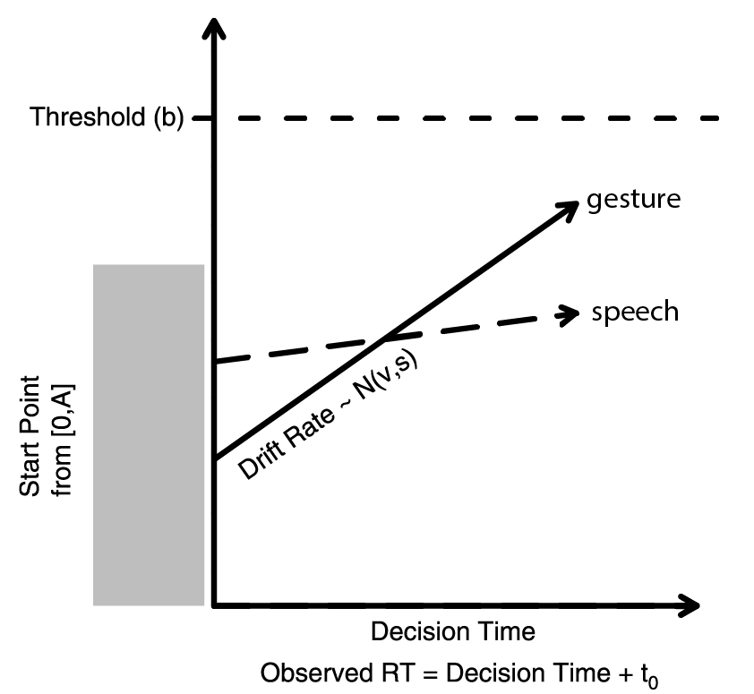

```{r setup, echo = FALSE}
library(knitr)
opts_chunk$set(message = FALSE, warning = FALSE, cache = TRUE, fig.align = "center")
```

```{r load_libraries, cache = FALSE, echo = FALSE}
library(dplyr)
library(tidyr)
library(data.table)
library(magrittr)
library(readr)
library(langcog)
library(ggplot2)
library(purrr)
library(broom)
library(bit64)
library(zoo)
library(rtdists)
library(lubridate)
library(stringr)
```

Let's assume that the primary reason that parents and children use language is to communicate. We'll suppose that communication begins with an intention to refer to something in the world. After the intention is fixed, the communicator has two choices of modalities: (1) speech---the communicator can produce the lexical item that refers to the entity, or (2) gesture---the communicator can produce a deictic gesture. 

We'll start by modeling this choice as a race between these two independent modalities. We'll use the Linear Ballistic Accumulator (LBA) model to implement this race (below). The process goes as follows:

(1) Some amount of time is required to produce the initial intention to communicate ($t_{0}$). I set this to .5s somewhat arbitrarily, but I suspect that is the right ballpark.

(2) Each modality begins with some amount of initial activation that ranges from 0 to $A$. This is supposed to account for some amount of trial-to-trial variability in response times. I set $A$ to 0 because it shouldn't matter for our purposes.

(2) Each modality has a drift rate that determines how quickly activation accumulates over time. These drift rates are modeled as draws from a $Normal(\mu,\sigma)$. We might assume that these drift rates vary as a function of things like how well known the lexical item is, how difficult the word form is to produce.

(3) Accumulation proceeds until the information reaches a threshold ($b$) in some modality, at which time a response is produced. I set the thresholds to be the median conversational response time estimated by Rohde & Frank (2014) for a corpus of 12- and 18-month-olds and their parents.

<div style="width:400px; text-align:center; margin:auto"> 

adapted from Donkin, Brown, & Heathcote (2011)

</div>

## Simulation 1

Let's set up a simple example just to get a feel for things. Let's assume that words vary in their production difficulty, and suppose further that this difficulty distribution is normal with high variance (following McMurray, 2007). Let's say that drift rates for adults correspond to this. 

Let's suppose that points are relatively costly to produce, but don't vary much. We expect under this model that adults will sometimes point to things instead of producing the words for them, and should be more likely to do so for harder-to-produce words. Let's set this up.

```{r toy_model, fig.width=5, fig.height=6}
#Parameters
A = 0 #Starting evidence max
b = 3 #Decision threshold
t0 = .5 #Non-Decision time
mean_word = 1.75
sd_word = .5 # Words are easy but variable
mean_gesture = 1
sd_gesture = .2 #gestures are hard but consistent

# Fit distribution
r_lba <- rlba_norm(1e4, A, b, t0, c(mean_word, mean_gesture), c(sd_word, sd_gesture)) %>%
  mutate(response = factor(response, labels = c("word", "gesture")))

#compute summary
summary_lba <- r_lba %>%
  group_by(response) %>%
  summarise(prop = n()/nrow(.), rt = mean(rt))

kable(summary_lba)

ggplot(data = r_lba, aes(x = rt, fill = response)) +
  facet_grid(response ~ .) + 
  geom_density(aes_string(y ="..count..")) +
  theme_bw(base_size = 16) + 
  geom_vline(aes(xintercept = rt), size = 1, lty = "dashed", data = summary_lba) + 
  theme(panel.grid = element_blank(), legend.position = "none",
        axis.title.x = element_text(vjust=-.5), axis.title.y = element_text(vjust=1)) +
  scale_x_continuous(limits = c(0, 6), name = "Reponse Time (seconds)") +
  scale_fill_brewer(palette = "Set1")
```

## Simulation 2

Let's set up a second more complex example. Suppose, for children, that the drift rate for words is a combination of whether they know the word, and if so how hard it is to produce. Let's suppose that chidren are more likely to know easier words.

Let's rank order words from 1 to 1000, and assume that children know words with probability proportional to 1/log(rank).

```{r toy_model2_setup, fig.width=6, fig.height=4}
know_word <- sapply(1:1000, function(x) rbinom(1, 1, 1/(log(x+2))))
rate_word <- (1.5 + (1/log(1:1000+2))) * know_word

rate_word_data <- data.frame(rate = rate_word, word = 1:1000) %>%
  mutate(rate = ifelse(rate == 0, NA, rate))

ggplot(rate_word_data, aes(x = word, y = rate)) +
  geom_point(size = 1, color = "#e41a1c") +
  theme_bw(base_size = 16) +
  theme(panel.grid = element_blank(), legend.position = "none",
        axis.title.x = element_text(vjust=-.5), axis.title.y = element_text(vjust=1)) +
  scale_y_continuous(limits = c(0, 3))
```

Then let's draw the difficulty of each word from a normal with a mean of (1 + 1/log(rank)) and sd of .2. Let's test each word 100 times.

```{r toy_model_2}
#Parameters
sd_word_2 = .2 # Individual words are consistent

r_child <- lapply(rate_word, function(rate) rlba_norm(100, A, b, t0, 
                                                      c(rate, mean_gesture),
                                                      c(sd_word_2, sd_gesture))) %>%
  bind_rows() %>%
  mutate(response = factor(response, labels = c("word", "gesture")))

#compute summary
summary_child <- r_child %>%
  group_by(response) %>%
  summarise(prop = n()/nrow(.), rt = mean(rt))

kable(summary_child)

ggplot(data = r_child, aes(x = rt, fill = response)) +
  facet_grid(response ~ .) + 
  geom_density(aes_string(y ="..count..")) +
  theme_bw(base_size = 16) + 
  geom_vline(aes(xintercept = rt), size = 1, lty = "dashed", data = summary_child) + 
  theme(panel.grid = element_blank(), legend.position = "none",
        axis.title.x = element_text(vjust=-.5), axis.title.y = element_text(vjust=1)) +
  scale_x_continuous(limits = c(0, 6), name = "Reponse Time (seconds)") +
  scale_fill_brewer(palette = "Set1")
```

## Analysis 

Now let's take a look at two 18-month-olds' data to see if we can find anything that looks like a signature of this kind of process. In particular, I want to see whether there is systematicity in the kinds of intentions that typically get expressed by words or by gestures. Ideally, we'd also like to try to look at the time it takes to produce these communicative acts, but that may need to wait.

Let's load the data.
```{r load_data}
# Data from two 18-month-olds
subjs <- c("043.02.tsv","059.02.tsv")

# Some regular expressions for cleaning up speech to get out the intended referents
clean_string <- function(string) {gsub("[^[:alnum:] /']", "", string)}
split_string <- function(string) {strsplit(string, " +")}

# Main subject loading function
load_subj <- function(file) {
  
  # Read the raw .tsv file
  subj <- suppressWarnings(fread(file, sep = "\t", data.table = F))
  
  # Convert ids to integers and time to time in minutes
  subj_clean <- subj %>%
    mutate(id = 1:n(),
           time = (period_to_seconds(hms(time)))/60)
  
  # Fix a timing error where the hour-unit did not track correctly
  if(is.na(subj_clean[1,"time"]))
    subj_clean[1,"time"] <- 0

  # Do a bunch of munging to get the data in a tidier format
  subj_clean %>%
    mutate(time = na.approx(time, na.rm = F),
           time_fix = time < cummax(time),
           time = ifelse(time_fix, time + 60, time)) %>% # Interpolate time
    gather(type, value, p_utts:c_mspd) %>%
    separate(type, c("person", "type")) %>%
    mutate(person = ifelse(person == "c", "child", "parent")) %>%
    filter(type %in% c("utts", "obj", "gloss", "form")) %>%
    spread(type, value) %>%
    select(-time_fix) %>%
    mutate_each(funs(clean_string), utts, form, gloss, obj) %>%
    filter((nchar(utts) + nchar(obj) + nchar(gloss) + nchar(form)) > 0)
}

# Load data
loaded_subjs <- lapply(subjs, load_subj) %>%
  bind_rows(.id = "subj")

# Show the first 20 rows of the new data frame
kable(head(loaded_subjs, 20))
```

Now let's try our first analysis: Which referents come out as words, which come out as gestures?

```{r obj_productions, fig.width = 10, fig.height = 5}
# Entries in the object array that I don't count as "objects"
filter_objs <- c("", "to", "of", "on", "was", "where", "in", "with", "X", "x2",
                 "P", "T", "x3", "C's", "M", "F", "F's", "C", "B", "SIB3", 
                 "SIB's", "AA", "big", "up", "small", "chewed", "pull", "fat",
                 "long", "down",  "playing", "kissing", "hugging", "open", 
                 "lit", "unlit", "tiny", "and", "own", "towards", "living", 
                 "obstructed")

# Get all of the objects that are talked about by the participants
all_objs <- paste(unique(loaded_subjs$obj), collapse = " ") %>%
  str_split(" ") %>%
  unlist() %>%
  unique() %>%
  setdiff(., filter_objs)

# Check whether one of the objects was talked about in each spoken production
resps <- loaded_subjs %>%
  rowwise() %>%
  mutate(present_obj = paste(all_objs[str_detect(utts, all_objs) > 0], 
                             collapse = " "))

# For each object, count how many times it was produced in word and gesture by 
# each participant
count_productions <- function(this_obj) {
  resps %>%
    group_by(subj, person) %>%
    summarise(gesture = sum(obj == this_obj),
              word = sum(str_detect(present_obj, this_obj) > 0)) %>%
    mutate(obj = this_obj)
}

# Combine together counts for all objects, make tidy dataframe
all_productions <- lapply(all_objs, count_productions) %>%
  bind_rows() %>%
  group_by(person, obj) %>%
  summarise_each(funs(sum), gesture, word) %>%
  gather(modality, count, gesture, word)

# Find all objects produced at least once across all participants, arrange in 
# descending order
produced_objs <- all_productions %>%
  group_by(obj) %>%
  summarise(count = sum(count)) %>%
  filter(count > 0) %>%
  arrange(desc(count)) %>%
  mutate(obj = factor(obj, levels = obj))

# Filter down to produced obejcts and arrange them
ordered_productions <- all_productions %>%
  filter(obj %in% produced_objs$obj) %>%
  mutate(obj = factor(obj, levels = levels(produced_objs$obj)))

# Plot
ggplot(ordered_productions, aes(x = obj, y = count, fill = modality)) +
  geom_bar(stat = "identity") + 
  facet_grid(person ~ .) + 
  theme_bw(base_size = 12) +
  theme(panel.grid = element_blank(), legend.position = c(.85,.85),
        legend.title = element_blank(), legend.text=element_text(size=10),
        axis.title.x = element_text(vjust=-.5), axis.title.y = element_text(vjust=1),
        axis.text.x = element_text(angle = 90, hjust = 1, vjust = .5)) +
  scale_x_discrete(name = "Referent") +
  scale_y_continuous(name = "Production Frequency") +
  scale_fill_brewer(palette = "Set1")
```

I think this is in line with our expectations: More frequent referents are produced most often as word, and rarer referents as gestures. This is especially true for children, who (we expect) may not know these words as in Simulation 2


