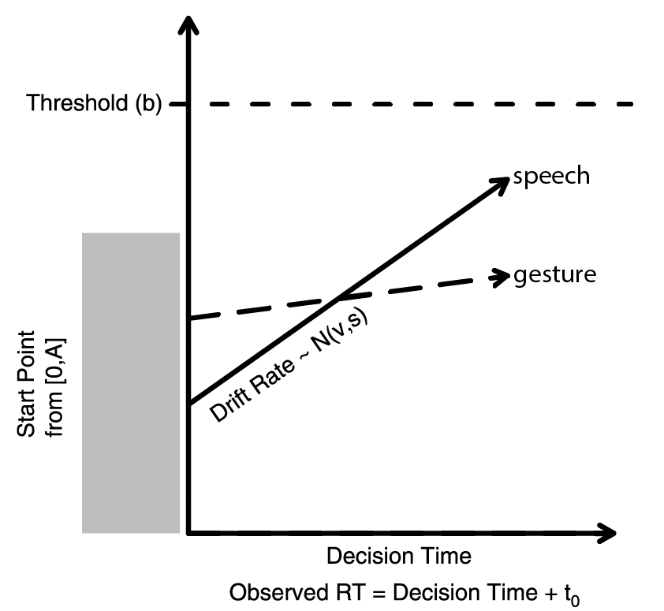

```{r setup, echo = FALSE}
library(knitr)
opts_chunk$set(message = FALSE, warning = FALSE, cache = TRUE, fig.align = "center")
```

```{r load_libraries, cache = FALSE, echo = FALSE}
library(dplyr)
library(tidyr)
library(data.table)
library(magrittr)
library(readr)
library(langcog)
library(ggplot2)
library(purrr)
library(broom)
library(bit64)
library(zoo)
library(rtdists)
library(lubridate)
library(stringr)
library(SnowballC)
library(directlabels)
library(lme4)
```

Let's assume that the primary reason that parents and children use language is to communicate. We'll suppose that communication begins with an intention to refer to something in the world. After the intention is fixed, the communicator has two choices of modalities: (1) speech---the communicator can produce the lexical item that refers to the entity, or (2) gesture---the communicator can produce a deictic gesture. 

We'll start by modeling this choice as a race between these two independent modalities. We'll use the Linear Ballistic Accumulator (LBA) model to implement this race (below). The process goes as follows:

(1) Some amount of time is required to produce the initial intention to communicate ($t_{0}$). I set this to .5s somewhat arbitrarily, but I suspect that is the right ballpark.

(2) Each modality begins with some amount of initial activation that ranges from 0 to $A$. This is supposed to account for some amount of trial-to-trial variability in response times. I set $A$ to 0 because it shouldn't matter for our purposes.

(2) Each modality has a drift rate that determines how quickly activation accumulates over time. These drift rates are modeled as draws from a $Normal(\mu,\sigma)$. We might assume that these drift rates vary as a function of things like how well known the lexical item is, how difficult the word form is to produce.

(3) Accumulation proceeds until the information reaches a threshold ($b$) in some modality, at which time a response is produced. I set the thresholds to be the median conversational response time estimated by Frank, Lewis, and MacDonald's (under review) analysis of the Fernald and Morikawa (1993) corpus of 12- and 18-month-olds and their parents.

<div style="width:400px; text-align:center; margin:auto"> 

adapted from Donkin, Brown, & Heathcote (2011)

</div>

## Simulation 1

Let's set up a simple example just to get a feel for things. Let's assume that words vary in their production difficulty, and suppose further that this difficulty distribution is normal with high variance (following McMurray, 2007). Let's say that drift rates for adults correspond to this. 

Let's suppose that points are relatively costly to produce, but don't vary much. We expect under this model that adults will sometimes point to things instead of producing the words for them, and should be more likely to do so for harder-to-produce words. Let's set this up.

```{r toy_model, fig.width=5, fig.height=6}
#Parameters
A = 0 #Starting evidence max
b = 3 #Decision threshold
t0 = .5 #Non-Decision time
mean_word = 1.75
sd_word = .5 # Words are easy but variable
mean_gesture = 1
sd_gesture = .2 #gestures are hard but consistent

# Fit distribution
r_lba <- rlba_norm(1e4, A, b, t0, c(mean_word, mean_gesture), c(sd_word, sd_gesture)) %>%
  mutate(response = factor(response, levels = c(2,1), labels = c("gesture", "word")))

#compute summary
summary_lba <- r_lba %>%
  group_by(response) %>%
  summarise(prop = n()/nrow(.), rt = mean(rt))

kable(summary_lba)

ggplot(data = r_lba, aes(x = rt, fill = response)) +
  facet_grid(response ~ .) + 
  geom_density(aes_string(y ="..count..")) +
  theme_bw(base_size = 16) + 
  geom_vline(aes(xintercept = rt), size = 1, lty = "dashed", data = summary_lba) + 
  theme(panel.grid = element_blank(), legend.position = "none",
        axis.title.x = element_text(vjust=-.5), axis.title.y = element_text(vjust=1)) +
  scale_x_continuous(limits = c(0, 6), name = "Reponse Time (seconds)") +
  scale_fill_brewer(palette = "Set1")
```

## Simulation 2

Let's set up a second more complex example. Suppose, for children, that the drift rate for words is a combination of whether they know the word, and if so how hard it is to produce. Let's suppose that chidren are more likely to know easier words.

Let's rank order words from 1 to 1000, and assume that children know words with probability proportional to 1/log(rank).

```{r toy_model2_setup, fig.width=6, fig.height=4}
know_word <- sapply(1:1000, function(x) rbinom(1, 1, 1/(log(x+2))))
rate_word <- (1.5 + (1/log(1:1000+2))) * know_word

rate_word_data <- data.frame(rate = rate_word, word = 1:1000) %>%
  mutate(rate = ifelse(rate == 0, NA, rate))

ggplot(rate_word_data, aes(x = word, y = rate)) +
  geom_point(size = .5, color = "#377eb8") +
  theme_bw(base_size = 16) +
  theme(panel.grid = element_blank(), legend.position = "none",
        axis.title.x = element_text(vjust=-.5), axis.title.y = element_text(vjust=1)) +
  scale_y_continuous(limits = c(0, 3))
```

Then let's draw the difficulty of each word from a normal with a mean of (1 + 1/log(rank)) and sd of .2. Let's test each word 100 times.

```{r toy_model_2, fig.width=5, fig.height=6}
#Parameters
sd_word_2 = .2 # Individual words are consistent

r_child <- lapply(rate_word, function(rate) rlba_norm(100, A, b, t0, 
                                                      c(rate, mean_gesture),
                                                      c(sd_word_2, sd_gesture))) %>%
  bind_rows() %>%
  mutate(response = factor(response, levels = c(2,1), labels = c("gesture", "word")))

#compute summary
summary_child <- r_child %>%
  group_by(response) %>%
  summarise(prop = n()/nrow(.), rt = mean(rt))

kable(summary_child)

ggplot(data = r_child, aes(x = rt, fill = response)) +
  facet_grid(response ~ .) + 
  geom_density(aes_string(y ="..count..")) +
  theme_bw(base_size = 16) + 
  geom_vline(aes(xintercept = rt), size = 1, lty = "dashed", data = summary_child) + 
  theme(panel.grid = element_blank(), legend.position = "none",
        axis.title.x = element_text(vjust=-.5), axis.title.y = element_text(vjust=1)) +
  scale_x_continuous(limits = c(0, 6), name = "Reponse Time (seconds)") +
  scale_fill_brewer(palette = "Set1")
```

## Simulation 3

Now let's check what happens as we increase the ease of producing speech but keep gesture constant. We should see changes in RT for both word and gesture, even though gesture itself doesn't change in it's time-to-produce! This is because in order to beat an easy-to-produce word, gesture has to come out really quickly.

```{r toy_model_3, fig.width=8, fig.height=6}
#Parameters

word_types <- c("easy", "medium", "hard")
words <- c(2.5, 1.5, .5)

sd_word = .5 # Words are easy but variable

mean_gesture = 1
sd_gesture = .2 #gestures are hard but consistent

fit_lba <- function(type, mean_word) {
  r_lba <- rlba_norm(1e4, A, b, t0, c(mean_word, mean_gesture), 
                      c(sd_word, sd_gesture)) %>%
  mutate(response = factor(response, levels = c(2,1), labels = c("gesture", "word")),
         type = type) 
}

all_lbas <- map2(word_types, words, fit_lba) %>%
  bind_rows() %>% 
  mutate(type = factor(type, levels = c("easy", "medium", "hard")))

#compute summary
summary_lbas <- all_lbas %>%
  group_by(type, response) %>%
  summarise(n = n(), rt = mean(rt)) %>%
  group_by(type) %>%
  mutate(n = n/sum(n))


kable(summary_lbas)

ggplot(data = all_lbas, aes(x = rt, fill = response)) +
  facet_grid(type ~ response) + 
  geom_density(aes_string(y ="..count..")) +
  theme_bw(base_size = 16) + 
  geom_vline(aes(xintercept = rt), size = 1, lty = "dashed", data = summary_lbas) + 
  theme(panel.grid = element_blank(), legend.position = "none",
        axis.title.x = element_text(vjust=-.5), axis.title.y = element_text(vjust=1)) +
  scale_x_continuous(limits = c(0, 6), name = "Reponse Time (seconds)") +
  scale_fill_brewer(palette = "Set1")
```

## Analysis 1

Now let's take a look at two parent-child dyads' data to see if we can find anything that looks like a signature of this kind of process. In particular, I want to see whether there is systematicity in the kinds of intentions that typically get expressed by words or by gestures. Ideally, we'd also like to try to look at the time it takes to produce these communicative acts, but that may need to wait.

```{r load_data_new}
files <- list.files("data/", "*.csv", full.names = TRUE)

loaded_subjs <- map(files, read_csv) %>%
  bind_rows() %>%
  mutate(age = ifelse(session == 2, 18, 22))

# Also load CHIDLES frequencies for words to get an alternate estimator
eng_freqs <- read_csv("data/other/counts_english.csv")
# 
# miscoded <- loaded_subjs %>%
#   filter((referent != spoken_obj) & (referent != gestured_obj))

demos <- loaded_subjs %>%
  select(subj,age) %>%
  distinct(subj,age) %>%
  group_by(age) %>%
  summarise(n = n())
  
kable(demos)
```


Now let's try our first analysis: Which referents come out as words, which come out as gestures?
```{r obj_productions, fig.width = 10, fig.height=5}
# Code matching referents in multi-referent communications
overlapping_referents <- function(refs1, refs2) {
  refs1 <- str_split(refs1, ",")[[1]]
  refs2 <- str_split(refs2, ",")[[1]]

  overlapping_refs <- sapply(refs1,
                             function(ref) contains(str_detect(refs2, ref),
                                                    TRUE))
  contains(overlapping_refs, TRUE)
}

# Fix up multi-referent communications
max_refs <- loaded_subjs %>%
  gather(ref_col, refs, spoken_obj,gestured_obj,referent) %>%
  mutate(num_refs = str_count(refs,",")) %>%
  summarise(num_refs = max(num_refs, na.rm = T)) %>%
  as.integer()

ref_list <- sapply(1:(max_refs + 1),function(x) paste0("referent",x))

spread_referents<- loaded_subjs %>%
  separate_("referent", ref_list, sep = ",", fill = "right") %>%
  gather_("number", "referent", ref_list) %>%
  filter(!is.na(referent), referent != "picture") %>%
  mutate(referent = tolower(str_trim(referent)))

# Consolidate referents that are labelled differently across dyads
consolidate_refs <- function(referent) {
  if(is.na(referent)) as.character(NA)
  else if(referent == "booty" | referent == "bottom") "butt"
  else if(referent == "chick") "chicken"
  else if(referent == "person") "man"
  else if(referent == "poopoo") "poop"
  else if(referent == "rabbit") "bunny"
  else if(referent == "steffi") "stephie"
  else if(referent == "stomach" | referent == "tummy") "belly"
  else if(referent == "taxicab") "taxi"
  else if(referent == "telephone") "phone"
  else if(referent == "toolbox") "box"
  else if(referent == "piece") "part"
  else referent
}

# Filter out abstract words that are difficult to communicate by gesture
filtered_referents <- spread_referents %>%
  filter(!referent %in% c("cold", "conversation", "date", "day", "downtown",
                          "fine", "ER", "ingredients of sandwich", "memory",
                          "morning", "one", "owner", "pound", "problem", 
                          "project", "request", "talk", "thief", "test", 
                          "final","time", "timeout", "upstairs", "weekend", 
                          "work", "story", "lunch", "hour", "minute", "damage", 
                          "second", "party", "birthday")) %>%
  rowwise() %>%
  mutate_each(funs(consolidate_refs), referent, spoken_obj, gestured_obj)


# Code responses and estimate response times
coded_responses <- filtered_referents %>%
  rowwise() %>%
  mutate(spoken = overlapping_referents(spoken_obj, referent) &
                         !overlapping_referents(gestured_obj, referent),
            gestured = overlapping_referents(gestured_obj, referent) &
                         !overlapping_referents(spoken_obj, referent),
            both = overlapping_referents(spoken_obj, referent) &
                         overlapping_referents(gestured_obj, referent)) %>%
  group_by(subj, age) %>%
  arrange(time) %>%
  mutate(rt = time - lag(time)) %>%
  rowwise() %>%
  mutate(rt = if(is.na(rt) | rt == 0 ) as.numeric(NA) else rt)

# Compute frequency of response by modality as well as RT
referent_counts <- coded_responses %>%
  gather(modality, value, spoken, gestured, both) %>%
  filter(value) %>%
  group_by(referent, person, modality) %>%
  summarise(n = n(),
            rt = mean(rt))

# Find all of the unique referents, divide them up by frequency
unique_refs <- referent_counts %>%
  group_by(referent) %>%
  summarise(total_n = sum(n)) %>%
  arrange(desc(total_n)) %>%
  mutate(rank = row_number()) %>%
  mutate(stem = wordStem(referent, "english")) %>%
  left_join(eng_freqs, by = c("stem" = "item")) %>%
  rename(stem_freq = count) %>%
  mutate(stem_cut = cut(stem_freq, 4),
         n_cut = cut(log(total_n), 4))

# Rearrange refernts by frequency
referent_counts_ordered <- referent_counts %>%
  left_join(unique_refs) %>%
  ungroup() %>%
  mutate(referent = factor(referent, levels = unique_refs$referent),
         modality = factor(modality, levels = c("gestured", "spoken", "both")))

#   
# missing_referents <- referent_counts %>%
#   filter((spoken + gestured + both) < n)


# Plot
ggplot(referent_counts_ordered, aes(x = referent, y = log(n+1), fill = modality)) +
  geom_bar(stat = "identity") + 
  facet_grid(person  ~ .) +
  theme_bw(base_size = 14) +
  theme(panel.grid = element_blank(), legend.position = c(.85,.85),
        legend.title = element_blank(), legend.text=element_text(size=10),
        axis.title.x = element_text(vjust=-.5), axis.title.y = element_text(vjust=1),
        axis.text.x = element_text(angle = 90, hjust = 1, vjust = .5,size = 8)) +
  scale_x_discrete(name = "Referent") +
  scale_y_continuous(name = "Log Production Frequency") +
  scale_fill_brewer(palette = "Set1")

all_modality_counts <- referent_counts_ordered %>%
  distinct(referent, total_n) %>%
  arrange(desc(total_n)) %>%
  mutate(rank = 1:nrow(.))

quartz(width = 6, height = 4)
ggplot(all_modality_counts, aes(x = rank, y = total_n)) + 
  geom_point(size = .25, color = "darkred") + 
  theme_bw(base_size = 18) +
  scale_x_continuous(name = "Referent rank frequency") +
  scale_y_continuous(name = "Referent frequency") +
  theme(panel.grid = element_blank(), 
        axis.title.x = element_text(vjust=-.5), axis.title.y = element_text(vjust=1)) 
```

We see some evidence that gesture is distributed differently for children and adults. Children appear to show the predicted pattern (more gesture for rarer words), adults do not. Let's test this statistically.

```{r by_modality aggregate, fig.width=5, fig.height=4}
total_usage <- referent_counts_ordered %>%
  select(referent, total_n, rank, n_cut) %>%
  distinct()

person_usage <- coded_responses %>%
  gather(modality, value, spoken, gestured, both) %>%
  filter(value) %>%
  group_by(referent, person, subj, modality) %>%
  summarise(n = n(),
            rt = median(rt, na.rm = T)) %>%
  left_join(total_usage) %>%
  mutate(modality = factor(modality, levels = c("gestured", "spoken", "both")))

modality_usage <- person_usage %>%
  group_by(person, n_cut, subj) %>%
  mutate(prop = n/sum(n)) %>%
  group_by(person, n_cut, subj, modality) %>%
  summarise(prop = sum(prop)) %>%
  group_by(n_cut, person, modality) %>%
  multi_boot_standard("prop")

ggplot(modality_usage, aes(x = as.numeric(n_cut), y = mean, color = modality,
                           label = modality)) +
  facet_grid(person  ~ .) +
  geom_pointrange(aes(ymax = ci_upper, ymin = ci_lower)) +
  geom_line() + 
  theme_bw(base_size = 14) +
  theme(panel.grid = element_blank(), legend.position = "none",
        legend.title = element_blank(), legend.text=element_text(size=10),
        axis.title.x = element_text(vjust=-.5), axis.title.y = element_text(vjust=1))+
  scale_x_continuous(name = "Log Frequency Quartile", limits = c(.5, 5), 
                     breaks = seq(1,4)) +
  scale_y_continuous(name = "Modality Probability") +
  scale_color_brewer(palette = "Set1") + 
  geom_dl(method = list(dl.trans(x=x +.2), "last.qp", cex=1))
```

I think this is in line with our expectations for children: More frequent referents are produced most often as word, and rarer referents as gestures. It's hard to say what's happening with parents. There is actually some evidence for the predicted effect, but it's weaker. Which might make sense in this context, given that both knowledge and fluency contribute for children, but presumably parents already know all of these words.

Now let's try RTs.

```{r modality_rt, fig.width=5, fig.height=4}
modality_rt <- person_usage %>%
  group_by(n_cut, person, modality, subj) %>%
  summarise(rt = mean(rt, na.rm = T)) %>%
  group_by(n_cut, person, modality) %>%
  multi_boot_standard("rt", na.rm = T)

ggplot(modality_rt, aes(x = as.numeric(n_cut), y = mean, color = modality,
                           label = modality)) +
  facet_grid(person  ~ .) +
  geom_pointrange(aes(ymax = ci_upper, ymin = ci_lower),
                  position = position_dodge(.1)) +
  geom_line(position = position_dodge(.1)) + 
  theme_bw(base_size = 14) +
  theme(panel.grid = element_blank(), legend.position = "none",
        legend.title = element_blank(), legend.text=element_text(size=10),
        axis.title.x = element_text(vjust=-.5), axis.title.y = element_text(vjust=1))+
  scale_x_continuous(name = "Log Frequency Quartile", limits = c(.5, 5), 
                     breaks = seq(1,4)) +
  scale_y_continuous(name = "Median Production Time") +
  scale_color_brewer(palette = "Set1") + 
  geom_dl(method = list(dl.trans(x=x +.3), "last.qp", cex=1))
```

This seems right! Gesture is slower than speech and scales with frequency. Harder to see what's happening with speech, but this might clear up as we keep adding data.

Let's try the density representation:
```{r modality_density, fig.width=6, fig.height=4}
modality_density <- person_usage %>%
  ungroup() %>%
  filter(modality != "both") %>%
  group_by(n_cut, person, modality, subj, referent) %>%
  summarise(n = n(),
            rt = median(rt, na.rm = T))

modality_summary <- modality_density %>%
  group_by(person, modality) %>%
  summarise(rt = median(rt, na.rm = T))

ggplot(data = modality_density, aes(x = rt, fill = modality)) +
  facet_grid(modality ~ person) + 
  geom_density(aes_string(y ="..count..")) +
  theme_bw(base_size = 16) + 
  geom_vline(aes(xintercept = rt), size = 1, lty = "dashed", data = modality_summary) + 
  theme(panel.grid = element_blank(), legend.position = "none",
        axis.title.x = element_text(vjust=-.5), axis.title.y = element_text(vjust=1)) +
  scale_x_continuous(limits = c(0, 1), name = "Reponse Time (seconds)") +
  scale_fill_brewer(palette = "Set1")
```


```{r aggregate, fig.width = 10, fig.height = 5, echo = FALSE}
#Combine data from all dyads in all sessions
# Combine together counts for all objects, make tidy dataframe
# all_productions <- lapply(all_objs, count_productions) %>%
#   bind_rows() %>%
#   group_by(person, obj, subj, session) %>%
#   summarise_each(funs(sum), gesture, word, both) %>%
#   gather(modality, count, gesture, word, both) %>%
#   mutate(modality = factor(modality, levels = c("gesture", "word", "both")))
# 
# # Find all objects produced at least once across all participants, arrange in 
# # descending order
# produced_objs <- all_productions %>%
#   group_by(obj) %>%
#   summarise(count = sum(count)) %>%
#   filter(count > 0) %>%
#   arrange(desc(count)) %>%
#   ungroup() %>%
#   mutate(obj = factor(obj, levels = (obj))) %>%
#   mutate(count_quant = cut(count, 4))
#   
# # Order objects by their production frequency in dyad data
# ordered_productions <- all_productions %>%
#   filter(obj %in% produced_objs$obj) %>%
#   ungroup() %>%
#   mutate(obj = factor(obj, levels = levels(produced_objs$obj)))
# 
# # Aggregate together for all dyads
# aggregate_productions <- ordered_productions %>%
#   group_by(person, obj, modality) %>%
#   summarise(count = sum(count))
# 
# # Plot
# ggplot(aggregate_productions, aes(x = obj, y = count, fill = modality)) +
#   geom_bar(stat = "identity") + 
#   facet_grid(person ~ .) + 
#   theme_bw(base_size = 14) +
#   theme(panel.grid = element_blank(), legend.position = c(.85,.85),
#         legend.title = element_blank(), legend.text=element_text(size=10),
#         axis.title.x = element_text(vjust=-.5), axis.title.y = element_text(vjust=1),
#         axis.text.x = element_text(angle = 90, hjust = 1, vjust = .5,size = 10)) +
#   scale_x_discrete(name = "Referent") +
#   scale_y_continuous(name = "Production Frequency") +
#   scale_fill_brewer(palette = "Set1")
```

## Analysis 2

Now let's try a different representation and test a further hypothesis: As children learn more words, they should gesture less, and this effect should be most pronounced for low-frequency words.

So let's aggregate data separately for each session. 

```{r by_session, fig.width = 7, fig.height=5}
person_session_usage <- coded_responses %>%
  gather(modality, value, spoken, gestured, both) %>%
  filter(value) %>%
  filter(modality != "both") %>%
  group_by(referent, person, subj, age, modality) %>%
  summarise(n = n(),
            rt = median(rt, na.rm = T)) %>%
  left_join(total_usage) %>%
  #mutate(modality = factor(modality, levels = c("gestured", "spoken", "both"))) %>%
  mutate(modality = factor(modality, levels = c("gestured", "spoken")))

modality_session_usage <- person_session_usage %>%
  group_by(person, n_cut, subj, age, modality) %>%
  summarise(n = sum(n)) %>%
  group_by(person, n_cut, subj, age) %>%
  mutate(prop = n/sum(n)) %>%
  group_by(person, n_cut, subj, age, modality) %>%
  summarise(prop = mean(prop))

full_session_usage <- expand.grid(person = unique(modality_session_usage$person),
                                  subj = unique(modality_session_usage$subj),
                                  age = unique(modality_session_usage$age),
                                  n_cut = unique(modality_session_usage$n_cut),
                                  modality = unique(modality_session_usage$modality)) %>%
  left_join(modality_session_usage) %>%
  #mutate(modality = factor(modality, levels = c("gestured", "spoken", "both"))) %>%
   mutate(modality = factor(modality, levels = c("gestured", "spoken"))) %>%
  mutate(prop = ifelse(is.na(prop), 0, prop)) %>%
  group_by(n_cut, person, age, modality) %>%
  multi_boot_standard("prop")

plot_data <- full_session_usage %>%
  ungroup() %>%
  filter(person == "child") %>%
  mutate(age = factor(age, labels = c("18 Months", "22 Months")))

quartz(width = 7, height = 3)
ggplot(plot_data, aes(x = as.numeric(n_cut), y = mean, color = modality,
                           label = modality)) +
  facet_grid(. ~ age) +
  geom_pointrange(aes(ymax = ci_upper, ymin = ci_lower), 
                  position = position_dodge(.2)) +
  geom_line() + 
  theme_bw(base_size = 14) +
  theme(panel.grid = element_blank(), legend.position = "none",
        legend.title = element_blank(), legend.text=element_text(size=10),
        axis.title.x = element_text(vjust=-.5), axis.title.y = element_text(vjust=1))+
  scale_x_continuous(name = "Log Frequency Quartile", limits = c(.5, 5), 
                     breaks = seq(1,4)) +
  scale_y_continuous(name = "Modality Probability") +
  scale_color_brewer(palette = "Set1") + 
  geom_dl(method = list(dl.trans(x=x +.2), "last.qp", cex=1))
```

That looks about right. Let's try RT

```{r by_session_rt, fig.width = 7, fig.height=5}
modality_session_rt <- person_session_usage %>%
  group_by(n_cut, person, modality, subj, age) %>%
  summarise(rt = mean(rt, na.rm= T)) %>%
  group_by(n_cut, person, age, modality) %>%
  multi_boot_standard("rt", na.rm = T)

ggplot(modality_session_rt, aes(x = as.numeric(n_cut), y = mean, color = modality,
                           label = modality)) +
  facet_grid(person ~ age) +
  geom_pointrange(aes(ymax = ci_upper, ymin = ci_lower),
                  position = position_dodge(.1)) +
  geom_line(position = position_dodge(.1)) + 
  theme_bw(base_size = 14) +
  theme(panel.grid = element_blank(), legend.position = "none",
        legend.title = element_blank(), legend.text=element_text(size=10),
        axis.title.x = element_text(vjust=-.5), axis.title.y = element_text(vjust=1))+
  scale_x_continuous(name = "Log Frequency Quartile") +
  scale_y_continuous(name = "Median Production Time") +
  scale_color_brewer(palette = "Set1") + 
  geom_dl(method = list(dl.trans(x=x +.3), "smart.grid", cex=1))

```

Again it's a little bit hard to say... Probably need to actually code RTs more sensibly

## Analysis 3

Let's try looking at individual words
```{r indiv_words, fig.width = 6, fig.height = 3.5}
# Subset down to only those referents found in multiple sessions
used_both_ages <- person_session_usage %>%
         filter(person == "child", modality != "both") %>%
  select(n_cut, referent, age, subj, n) %>%
  group_by(n_cut, referent, age, subj) %>%
  summarise(n = n()) %>%
  spread(age, n) %>%
  filter(!is.na(`18`) & !is.na(`22`)) %>%
  gather(age, n, `18`, `22`) %>%
  mutate(age = as.numeric(age)) %>%
  select(-n) 

# Compute proportion spoken for each referent in each session for each child
indiv_ref_props <- left_join(used_both_ages,
                              filter(person_session_usage, person == "child",
                                     modality != "both")) %>%
  select(-rt) %>%
  spread(modality, n) %>%
  mutate(spoken = ifelse(is.na(spoken), 0, as.numeric(spoken)),
         gestured = ifelse(is.na(gestured), 0, as.numeric(gestured))) %>%
  gather(modality, n, gestured, spoken) %>%
  group_by(n_cut, referent, age, subj) %>%
  mutate(prop = n/sum(n)) %>%
  group_by(modality, add = TRUE) %>%
  summarise(prop = mean(prop)) %>%
  filter(modality == "spoken") %>%
  select(-modality) %>%
  filter(n_cut != "(-0.00663,1.66]") # Too sparse

aggregate_ref_props <- indiv_ref_props %>%
  group_by(n_cut, age, referent, subj) %>%
  summarise(prop = mean(prop)) %>%
  summarise(prop = mean(prop)) %>%
  group_by(n_cut, age) %>%
  multi_boot_standard("prop")
  
ggplot(aggregate_ref_props, aes(x = as.numeric(as.factor(n_cut)), 
                                y = mean, color = as.factor(age),
                                label = as.factor(age))) +
  geom_pointrange(aes(ymax = ci_upper, ymin = ci_lower),
                  position = position_dodge(.1)) +
  geom_line(position = position_dodge(.1)) + 
  theme_bw(base_size = 14) +
  theme(panel.grid = element_blank(), legend.position = "none",
        legend.title = element_blank(), legend.text=element_text(size=10),
        axis.title.x = element_text(vjust=-.5), axis.title.y = element_text(vjust=1))+
  scale_x_continuous(name = "Log Frequency Quartile", limits = c(.5, 5), 
                     breaks = seq(1,4)) +
  scale_y_continuous(name = "Spoken Production Probability") +
  scale_color_brewer(palette = "Set1") + 
  geom_dl(method = list(dl.trans(x=x +.5), "last.qp", cex=1))
```

## Analysis 4

Let's fit a statistical model

```{r models}
model_data <- person_session_usage %>%
  filter(person == "child") %>%
  select(referent, subj, age, modality, n, n_cut, total_n) %>%
  group_by(n_cut, person, subj, age, referent, total_n) %>%
  filter(modality != "both") %>%
  spread(modality, n) %>%
  mutate(spoken = ifelse(is.na(spoken), 0, as.numeric(spoken)),
         gestured = ifelse(is.na(gestured), 0, as.numeric(gestured))) %>%
  mutate(prop_spoken = spoken / (spoken + gestured))


nonbinary_data <- model_data %>%
  filter(gestured > 0 & spoken > 0)

plotting_data <- model_data %>%
  filter(person == "child") %>%
  mutate(log_freq = floor(log(total_n))) %>%
  group_by(log_freq,person,subj,age) %>% 
  summarise(spoken = sum(spoken),
            gestured = sum(gestured)) %>%
  gather(modality, n, spoken, gestured) %>%
  group_by(log_freq, age, subj) %>%
  mutate(prop = n/sum(n)) %>%
  group_by(log_freq, person, age, modality) %>%
  multi_boot_standard("prop")


model1 <- glmer(cbind(spoken, gestured) ~ age * as.numeric(n_cut) + (1|subj) + (1|referent), 
               family = "binomial", data = model_data)

model2 <- glmer(cbind(spoken, gestured) ~ age * log(total_n) + (1|subj) + (1|referent), 
               family = "binomial", data = model_data)


model3 <- glmer(cbind(spoken, gestured) ~ log(total_n) + (1|subj) + (1|referent), 
               family = "binomial", data = nonbinary_data)


model_data$predicted <- predict(model2, type = "response")
cor(model_data$predicted, model_data$prop_spoken)

ggplot(model_data, aes(x = predicted, y = prop_spoken, color = referent)) + 
  geom_jitter() + 
  theme_bw() + 
  theme(legend.position = "none")


model3 <- glmer((spoken > 0) ~ age * log(total_n) + (1|subj) + (1|referent),
                family = "binomial", data = model_data)

model_data$predicted2 <- predict(model3, type = "response")
cor(model_data$predicted2, (model_data$prop_spoken > 0))

kable(summary(model2)$coefficients)


quartz(width = )
ggplot(plotting_data, aes(x = log_freq, 
                                y = mean, color = modality,
                                label = modality)) +
  facet_grid(. ~ age) +
  geom_line()+
 # geom_smooth(method = "lm") +
  geom_pointrange(aes(ymax = ci_upper, ymin = ci_lower),
                  position = position_dodge(.1)) +
  theme_bw(base_size = 14) +
  theme(panel.grid = element_blank(), legend.position = "none",
        legend.title = element_blank(), legend.text=element_text(size=10),
        axis.title.x = element_text(vjust=-.5), axis.title.y = element_text(vjust=1))+
  scale_x_continuous(name = "Log Frequency Production") +
  scale_y_continuous(name = "Spoken Production Probability") +
  scale_color_brewer(palette = "Set1") + 
  geom_dl(method = list(dl.trans(x=x +.5), "last.qp", cex=1))

```

```{r load_data_old, echo = FALSE}
# # Data from two children at 18-month and 24 mo
# files <- list.files("data/", "*.tsv")
# 
# # Some regular expressions for cleaning up speech to get out the intended referents
# clean_string <- function(string) {gsub("[^[:alnum:] /']", "", string)}
# split_string <- function(string) {strsplit(string, " +")}
# 
# # Main subject loading function
# load_subj <- function(file) {
# 
#   splits <- strsplit(file,"\\.")[[1]]
#   subj_name <- splits[1]
#   subj_session <- splits[2]
# 
#   # Read the raw .tsv file
#   subj <- suppressWarnings(fread(paste0("data/",file), sep = "\t",
#                                  data.table = F))
# 
#   # Convert ids to integers and time to time in minutes
#   subj_clean <- subj %>%
#     mutate(id = 1:n(),
#            time = (period_to_seconds(hms(time)))/60)
# 
#   # Fix a timing error where the hour-unit did not track correctly
#   if(is.na(subj_clean[1,"time"]))
#     subj_clean[1,"time"] <- 0
# 
#   # Do a bunch of munging to get the data in a tidier format
#   subj_clean %>%
#     mutate(time = na.approx(time, na.rm = F),
#            time_fix = time < cummax(time),
#            time = ifelse(time_fix, time + 60, time)) %>% # Interpolate time
#     gather(type, value, p_utts:c_gs_rel) %>%
#     separate(type, c("person", "type"), extra = "merge") %>%
#     mutate(person = ifelse(person == "c", "child", "parent")) %>%
#     filter(type %in% c("utts", "obj", "gloss", "form", "gs_rel")) %>%
#     spread(type, value) %>%
#     select(-time_fix) %>%
#     mutate_each(funs(clean_string), utts, form, gloss, obj) %>%
#     filter((nchar(utts) + nchar(obj) + nchar(gloss) + nchar(form)) > 0) %>%
#     mutate(subj = subj_name, session = subj_session)
# }
# 
# # Load data
# loaded_subjs <- lapply(files, load_subj) %>%
#   bind_rows()
```

```{r frequency_old, fig.width = 8, fig.height = 6, echo = FALSE}
# freq_productions <- ordered_productions %>%
#   group_by(person, session, obj, modality) %>%
#   summarise(count = sum(count)) %>%
#   mutate(prop = count/sum(count)) %>%
#   select(-count) %>%
#   left_join(produced_objs) %>%
#   mutate(modality = factor(modality, levels = c("gesture", "word", "both")),
#          count_quant = as.numeric(factor(count_quant, 
#                                          levels = rev(levels(count_quant))))) %>%
#   group_by(person, session, modality, count_quant) %>%
#   multi_boot_standard("prop", na.rm = T)
#   
# ggplot(freq_productions, aes(x = count_quant, y = mean, fill = modality,
#                              color = modality)) +
#   geom_pointrange(aes(ymax = ci_upper, ymin = ci_lower)) +
#   geom_smooth(method = "lm", se = FALSE) +
#   facet_grid(person ~ session) + 
#   theme_bw(base_size = 14) +
#   theme(panel.grid = element_blank(), legend.position = c(.75,.75),
#         legend.title = element_blank(), legend.text=element_text(size=10),
#         axis.title.x = element_text(vjust=-.5), axis.title.y = element_text(vjust=1),
#         axis.text.x = element_text(angle = 90, hjust = 1, vjust = .5,size = 10)) +
#   scale_x_continuous(name = "Total Production Frequency Quintile") +
#   scale_y_continuous(name = "Production Proportion") +
#   scale_color_brewer(palette = "Set1") + 
#   scale_fill_brewer(palette = "Set1")
```  


```{r gesture_prop, fig.width = 6, fig.height = 4, echo = FALSE}

# 
# It's a little bit hard to see because we don't have much data, but I think the prediction is probably borne out. High-frequency referents (left side of the graph) are communicated about using words, low-frequency relatively more likely to be communicated about using gestures. There's also a hint of the predicted developmental effect, but it looks like adults also gesture more, so I wouldn't take it to the bank yet.
# 
# Let's also do one more thing: let's check what kinds of gestures are produced.
# produced_gestures <- resps %>%
#   filter(length(gestured_obj) > 0 | length(present_obj) > 0) %>%
#   group_by(gs_rel) %>%
#   filter(gs_rel != "Unclear") %>%
#   summarise(count = n()) %>%
#   arrange(desc(count)) %>%
#   ungroup() %>%
#   mutate(gs_rel = factor(gs_rel, levels = (gs_rel)))
# 
# gesture_props <- resps %>%
#   filter(gs_rel != "Unclear") %>%
#   mutate(gs_rel = factor(gs_rel, levels = levels(produced_gestures$gs_rel))) %>%
#   group_by(person, session, subj, gs_rel) %>%
#   summarise(count = n()) %>%
#   mutate(prop = count/sum(count)) %>%
#   group_by(person, session, gs_rel) %>%
#   summarise(prop = mean(prop, na.rm = T))
#   
# ggplot(gesture_props, aes(x = session, y = prop, fill = gs_rel)) +
#   geom_bar(stat = "identity") +
#   facet_grid(person ~ .) + 
#   theme_bw(base_size = 14) +
#   theme(panel.grid = element_blank(), #legend.position = c(.75,.75),
#         legend.title = element_blank(), legend.text=element_text(size=10),
#         axis.title.x = element_text(vjust=-.5), axis.title.y = element_text(vjust=1),
#         axis.text.x = element_text(angle = 90, hjust = 1, vjust = .5,size = 10)) +
#   scale_x_discrete(name = "Session") +
#   scale_y_continuous(name = "Production Proportion") +
#   scale_fill_brewer(palette = "Set1")
```


```{r, echo = FALSE}

# Looks to me mostly like gestures, and especially gestures that Add information decline over sessions. That seems sensible.
# 
# This is a pretty low-power analysis, but let's try this by referent frequency.
# # count_productions <- function(this_obj) {
# #   resps %>%
# #     group_by(person, subj, session, gs_rel) %>%
# #     summarise(gesture = sum(obj == this_obj),
# #               word = sum(str_detect(present_obj, this_obj) > 0)) %>%
# #     mutate(both = word & gesture) %>%
# #     mutate(obj = this_obj)
```  


```{r load_data_oldest, echo = FALSE}
#Old loading code let's load the data.
# # Data from two 18-month-olds
# files <- list.files("data/", "*.tsv")
# 
# # Some regular expressions for cleaning up speech to get out the intended referents
# clean_string <- function(string) {gsub("[^[:alnum:] /']", "", string)}
# split_string <- function(string) {strsplit(string, " +")}
# 
# # Main subject loading function
# load_subj <- function(file) {
#   
#   splits <- strsplit(file,"\\.")[[1]]
#   subj_name <- splits[1]
#   subj_session <- splits[2]
#   
#   # Read the raw .tsv file
#   subj <- suppressWarnings(fread(paste0("data/",file), sep = "\t", 
#                                  data.table = F))
#   
#   # Convert ids to integers and time to time in minutes
#   subj_clean <- subj %>%
#     mutate(id = 1:n(),
#            time = (period_to_seconds(hms(time)))/60)
#   
#   # Fix a timing error where the hour-unit did not track correctly
#   if(is.na(subj_clean[1,"time"]))
#     subj_clean[1,"time"] <- 0
# 
#   # Do a bunch of munging to get the data in a tidier format
#   subj_clean %>%
#     mutate(time = na.approx(time, na.rm = F),
#            time_fix = time < cummax(time),
#            time = ifelse(time_fix, time + 60, time)) %>% # Interpolate time
#     gather(type, value, p_utts:c_gs_rel) %>%
#     separate(type, c("person", "type"), extra = "merge") %>%
#     mutate(person = ifelse(person == "c", "child", "parent")) %>%
#     filter(type %in% c("utts", "obj", "gloss", "form", "gs_rel")) %>%
#     spread(type, value) %>%
#     select(-time_fix) %>%
#     mutate_each(funs(clean_string), utts, form, gloss, obj) %>%
#     filter((nchar(utts) + nchar(obj) + nchar(gloss) + nchar(form)) > 0) %>%
#     mutate(subj = subj_name, session = subj_session)
# }
# 
# # Load data
# loaded_subjs <- lapply(files, load_subj) %>%
#   bind_rows()
```


```{r code_gesture, echo = FALSE}
#Original Recode gestures to be English readable
# code_gesture <- function(gesture) {
#   if(gesture == "") "None"
#   else if(gesture == "ADD") "Add" 
#   else if(gesture == "X") "Only Gesture"
#   else if(gesture == "RF") "Reinforce"
#   else if(gesture == "FA") "Add"
#   else if(gesture == "DA") "Disambiguate"
#   else if(gesture == "ELAB") "Elaborate"
#   else if(gesture == "UC") "Unclear"
#   else if(gesture == "E") "Emphasis"
# }
# 
# coded_subjs <- loaded_subjs %>%
#   mutate(gs_rel = sub("[.;( ].*", "", gs_rel)) %>%
#   rowwise() %>%
#   mutate(gs_rel = code_gesture(gs_rel)) %>%
#   select(subj, session, time, person, utts, form, gloss, obj, gs_rel)
# 
# # Show the 20 rows of the new data frame
# kable(coded_subjs[51:70,])
```

```{r obj_productions_old, echo = FALSE}
# Entries in the object array that I don't count as "objects"
# filter_objs <- c("", "to", "of", "on", "was", "where", "in", "with", "X", "x2",
#                  "P", "T", "x3", "C's", "M", "F", "F's", "C", "B", "SIB3", 
#                  "SIB's", "AA", "big", "up", "small", "chewed", "pull", "fat",
#                  "long", "down",  "playing", "kissing", "hugging", "open", 
#                  "lit", "unlit", "tiny", "and", "own", "towards", "living", 
#                  "obstructed", "upside", "covered", "near", "not", "is", "inside",
#                  "E/camera", "that", "can")
# 
# # Get all of the objects that are talked about by the participants
# all_objs <- paste(unique(coded_subjs$obj), collapse = " ") %>%
#   str_split(" ") %>%
#   unlist() %>%
#   unique() %>%
#   setdiff(., filter_objs)
# 
# check_word <- function(string, words) {
#   split <- str_split(string, " ")[[1]]
#   matches <- paste(sapply(split, function(x) paste(words[words == x], 
#                                                    collapse = " ")),
#                    collapse = " ")
#   str_trim(matches)
# }
# 
# 
# # resps <- coded_subjs %>%
# #   rowwise() %>%
# #   mutate(present_obj = paste(all_objs[str_detect(utts, all_objs) > 0], 
# #                              collapse = " "),
# #          gestured_obj = paste(all_objs[str_detect(obj, all_objs) > 0], 
# #                              collapse = " "))
# 
# # Check whether one of the objects was talked about in each spoken production
# resps <- coded_subjs %>%
#   rowwise() %>%
#   mutate(present_obj = check_word(utts, all_objs),
#          gestured_obj = check_word(obj, all_objs))
# 
# tmp <- resps %>%
#   split(paste(.$subj, .$session)) %>%
#   map(function(df) write_csv(df, paste0("data/", df[1,"subj"], "_", df[1,session])))
# 
# function()
# 
# # For each object, count how many times it was produced in word and gesture by 
# # each participant
# count_productions <- function(this_obj) {
#   resps %>%
#     rowwise() %>%
#     mutate(gesture = sum(this_obj == gestured_obj) > 0,
#               word = sum(this_obj == present_obj) > 0) %>%
#     mutate(both = word & gesture) %>%
#     group_by(person, subj, session) %>%
#     summarise_each(funs(sum), word, gesture, both) %>%
#     mutate(obj = this_obj)
# }
```

